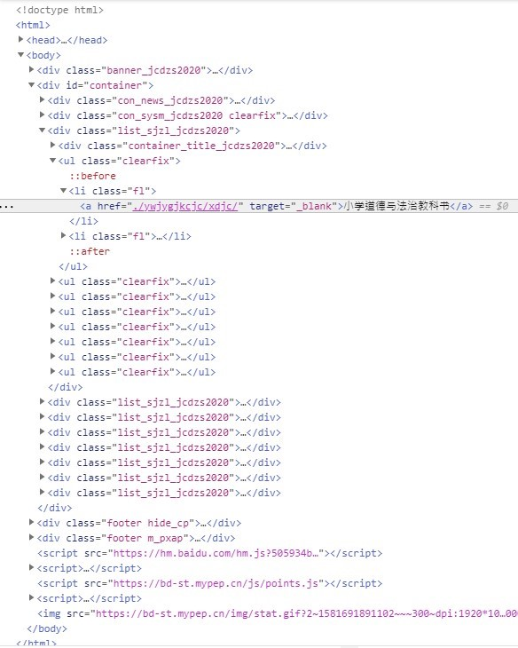

### 用C#从人教社下载中小学电子教材
昨天看新闻，说人教社开放了人教版中小学教材电子版的春季教材（下载地址：http://bp.pep.com.cn/jc/ )，就想着给儿子全下载下来以备后用。不过人工下载真是麻烦枯燥，就为了省事，就写个爬虫。原本打算用python，回头想了下，好久没用C#了，就用C#写吧。

具体思路和实现步骤如下

1. 分析相关网页的结构和连接跳转来了解如何获取到电子书的网页地址。

首先，涉及的页面主要又两页，第一个页面是分类目录页面，里面按小学，中学这些分了大的类别，每个大的类别下面又有学科这些小的类别，第二个是每个学科下的各个年级的电子书下载详情页面。

根据上述两个页面的情况，我决定首先从第一个页面来获取到所有大类及各个大类下面每个学科的网页地址，再依次迭代上述各学科网页的内容，从其内容获取每个电子书的地址，最后来多线程异步来下载每个学科下的电子书。

2. 要从html页面获取电子书地址，就必须用到两个类库，一个用来处理访问网页和网络下载的网络类，一个是用来分析html结构的类库。这里我选用了WebClient和HtmlAgilityPack。

3. 根据第1步的思路，先分析分类目录的页面的html代码结构情况（见下图），用第二步选择的类库来实现获取大分类目录及其下各学科页面网址，返回结果用Dictionary<string,List<string>>来存放，其中，key表示小学，初中，高中这些大的分类名称，List<string>表示大分类下各学科的页面地址。 


具体实现代码如下：

```

            //获取各学科各页面地址
            public async Task<Dictionary<string, List<string>>> GetSubjectPageUrlsAsync()
            {
                var url = BASE_URL;
                Dictionary<string, List<string>> bookUrls = new Dictionary<string, List<string>>();

                var categoryXpath = "//*[@id=\"container\"]/div[@class=\"list_sjzl_jcdzs2020\"]";

                //获取指定地址的html页面内容
                WebClient webClient = new WebClient();
                var content = await webClient.DownloadStringTaskAsync(url);

                //加载html内容到HtmlDocument以便处理内容
                HtmlDocument htmlDocument = new HtmlDocument();
                htmlDocument.LoadHtml(content);

                //获取指定路径的节点集合
                HtmlNodeCollection booksListEle = htmlDocument.DocumentNode.SelectNodes(categoryXpath);

                if (booksListEle != null)
                {
                    foreach (var item in booksListEle)
                    {
                        //获取中学，小学等这些分类名称
                        string title = string.Empty;
                        var titleNode = item.SelectSingleNode(".//div[@class=\"container_title_jcdzs2020\"]");
                        if (titleNode != null)
                        {
                            title = titleNode?.InnerText;
                        }

                        //获取中学，小学等这些分类下的各学科页面所在地址
                        HtmlNodeCollection urlsNodes = item.SelectNodes(".//a");
                        if (urlsNodes?.Count > 0)
                        {
                            var list = new List<string>();
                            foreach (HtmlNode urlItem in urlsNodes)
                            {
                                var fullUrl = url + urlItem.Attributes["href"].Value.Substring(2);
                                list.Add(fullUrl);
                            }

                            if (!string.IsNullOrEmpty(title) && list.Count > 0)
                            {
                                bookUrls.Add(title, list);
                            }
                        }
                    }
                }
                return bookUrls;
            }
```
 

4.  迭代第3步所示结果，，根据各学科页面的Html内容结构（见下图），从各个学科页面内容中进行电子书地址提取。


具体代码如下：

```

            //获取各学科页面中的电子书地址
            private async Task<(string Subject, List<(string BookName, string BookUrl)> Books)> GetSubjectBooksAsync(string url)
            {
                const string contentRootXpath = "//*[@id=\"container\"]/div[@class=\"con_list_jcdzs2020\"]";

                //Get html content
                WebClient client = new WebClient();
                string webcontent = await client.DownloadStringTaskAsync(url);

                //load html string with HtmlDocument
                HtmlDocument htmlDocument = new HtmlDocument();
                htmlDocument.LoadHtml(webcontent);

                HtmlNode rootNode = htmlDocument.DocumentNode.SelectSingleNode(contentRootXpath);

                //Get the subject.获取学科名称
                HtmlNode titleEle = rootNode.SelectSingleNode(".//div[@class=\"con_title_jcdzs2020\"]");
                string subject = string.Concat(titleEle?.InnerText.Where(c => !char.IsWhiteSpace(c)));

                //Get all books of the subject. 
                //获取学科下所有书列表并开始下载
                HtmlNodeCollection bookNodes = rootNode.SelectNodes(".//li");
                List<(string BookName, string BookUrl)> books = new List<(string BookName, string BookUrl)>();
                if (bookNodes != null && bookNodes.Count>0)
                {
                    string bookName = null;
                    string bookUrl = null;

                    foreach (HtmlNode liItem in bookNodes)
                    {
                        bookName = FixFileName(string.Concat(liItem.ChildNodes["h6"].InnerText.Where(c => !char.IsWhiteSpace(c))));//get book's name
                        bookUrl = liItem.ChildNodes["div"].ChildNodes[3].Attributes["href"].Value;//get the url of ebook

                        books.Add((bookName, bookUrl));
                    }
                }
                return (subject,books);
            }
```

5. 用从第4步中的获取的电子书地址开始下载电子书。具体代码如下：

```

            //下载单个科目下的所有书籍
            private async Task DownloadBooksAsync(string dir, string baseUrl, (string Subject, List<(string BookName, string BookUrl)> Books) books,Action<string, string> callback)
            {
                //Create the subdirectory under the specified directory.
                //创建子目录
                dir = Path.Combine(dir, books.Subject);
                dir = FixPath(dir);
                if (!Directory.Exists(dir))
                {
                    Directory.CreateDirectory(dir);
                }

                //构建下载任务列表
                List<Task> downloadTasks = new List<Task>();
                int count = 0;
                foreach (var book in books.Books)
                {
                    WebClient wc = new WebClient();
                    Uri.TryCreate(baseUrl + book.BookUrl[2..], UriKind.Absolute, out Uri bookUri);
                    var path = Path.Combine(dir, @$"{book.BookName}.pdf");
                    var fi = new FileInfo(path);
                    if (!fi.Exists || fi.Length == 0)
                    {
                        var task = wc.DownloadFileTaskAsync(bookUri, path);
                        downloadTasks.Add(task);
                        count++;
                    }
                }

                //等待所有下载任务执行完后，执行回调函数
                await Task.WhenAll(downloadTasks).ContinueWith((task) => { callback(books.Subject ?? string.Empty, count.ToString()); });
            }

```

6. 到这里，最核心几个方法已经完成。下来就可以根据自己的界面交互需要，来选择相应的实现方式，例如图形界面，控制台或者网页等，并来根据面向界面编写具体的应用逻辑。为了节省时间和简单起见，我选择了控制台。其具体的代码不在这里叙述了，如有兴趣，可以从github下载完整代码查看。具体github的地址为：https://github.com/topstarai/PepBookDownloader
